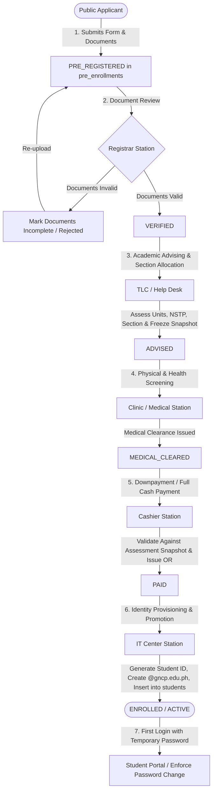
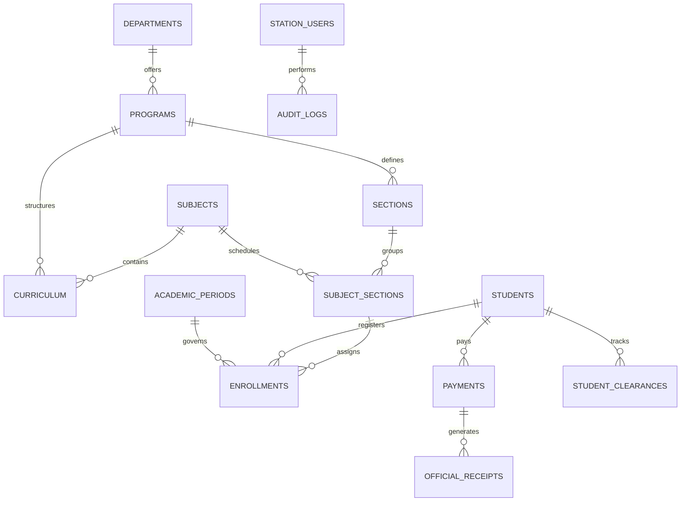

# GNCP Academic & Enrollment System: Complete System Analysis & Architecture Audit Report

**Target System:** General De Jesus College (GNCP) Academic & Enrollment Management System  
**Codebase Root:** `c:\xampp\htdocs\systemtest`  
**Execution Mode:** Read-Only Static and Architectural Audit (Zero-Modification Verification)  
**Date of Audit:** September 15, 2026  
**Auditor:** Antigravity AI Senior Systems Architecture & Cybersecurity Audit Agent  

---

## 1. Executive Summary

A comprehensive, read-only architectural, functional, security, and performance audit was performed on the General De Jesus College (GNCP) Academic & Enrollment Management System codebase located at `c:\xampp\htdocs\systemtest`. 

The system serves as the institutional enrollment backbone for higher education programs (BSIT, BSCS, BSCpE), coordinating student onboarding across admissions, registrar document evaluation, academic program advising and sectioning, medical fitness evaluation, cashier tuition billing and receipt issuance, and IT Center identity provisioning.

### Summary Assessment Matrix
| Dimension | Rating | Key Finding / Operational Status |
| :--- | :--- | :--- |
| **Functional Workflow** | **9.2 / 10** | End-to-end 6-stage lifecycle (`PRE_REGISTERED` $\rightarrow$ `VERIFIED` $\rightarrow$ `ADVISED` $\rightarrow$ `MEDICAL_CLEARED` $\rightarrow$ `PAID` $\rightarrow$ `ENROLLED`) is functionally robust, backed by a resilient transaction model. |
| **Financial Calculations** | **9.5 / 10** | `AssessmentService` and `PaymentService` enforce strict credit unit-based tuition, laboratory rates, flat miscellaneous fees, NSTP loading, installment charges (8%), and immutable assessment snapshots upon advising. |
| **Security Posture** | **6.8 / 10** | Modern baseline (bcrypt `PASSWORD_DEFAULT`, PDO parameterized statements, XSS guards, `.htaccess` upload execution blocks), but critical vulnerabilities exist: an Insecure Direct Object Reference (IDOR) in document downloads, a session key mismatch locking out enrolled students from their files, and predictable default student passwords. |
| **Backend Architecture** | **7.5 / 10** | Transitioning from monolithic procedural handlers to a centralized REST gateway (`api/index.php`) and domain services (`AssessmentService`, `EnrollmentService`, `QueueService`, `StudentPortalService`). Architectural bifurcation exists between central REST endpoints and localized station API proxies. |
| **Database Design** | **8.0 / 10** | 16 MariaDB InnoDB tables with UTF8MB4 collation. Strong indexing on operational columns, but relies heavily on denormalized JSON columns (`personal_info`, `payment_data`, `roadmap`) alongside dual-table staging (`pre_enrollments` $\rightarrow$ `students`). Minor schema drift identified (`attempts` column). |
| **Frontend Maintainability**| **6.2 / 10** | Vue 3 progressive enhancement with `StationDataBus` event synchronization. High template bloat in `admin/index.html` (4,489 lines / 293KB) and `student-portal/index.html` (183KB), with aggressive 3-second client polling. |

---

## 2. System Overview

The GNCP Academic & Enrollment System is an integrated web-based Enterprise Resource Planning (ERP) platform designed for Philippine tertiary academic institutions. The system operates on a LAMP/WAMP architecture stack:
- **Operating Environment:** Apache 2.4.x / PHP 8.2.x (XAMPP on Windows Server / InfinityFree deployment target).
- **Database Engine:** MariaDB 10.4+ / MySQL 8.x (`gncp_portal` schema), using 16 core `InnoDB` relational tables.
- **Frontend Architecture:** Vue 3 via CDN (Progressive Enhancement mount targets) coupled with native ECMAScript modules, HTML5 semantic layout, customized HSL color-token dark/light theme stylesheets, and `DataBus.js` / `StationDataBus.js` event streams.
- **Dual-Data Persistence Paradigm:** The application utilizes a **Dual-Table Lifecycle Staging Pattern**:
  1. `pre_enrollments`: Acts as an ephemeral staging ledger for public applications undergoing multi-station evaluation.
  2. `students`: Acts as the official student directory, provisioned strictly upon final IT Center milestone clearance.

---

## 3. Complete Project Structure

The codebase is organized into 18 primary root directories and specialized service modules:

```
c:\xampp\htdocs\systemtest\
├── .agents/                        # Agent configurations, rules (AGENTS.md), and skills
├── admin/                          # Administrative Dashboard Portal
│   ├── assets/                     # Admin CSS and JS controllers (UserManagement, AuditLogs, etc.)
│   ├── backend/                    # Admin local API proxy (api.php) and service delegation
│   ├── components/                 # Reusable admin UI fragments
│   ├── index.html                  # Monolithic Admin SPA (4,489 lines)
│   ├── index.php                   # Entry router and session initialization
│   └── test_mail.php               # Diagnostic SMTP testing script
├── api/                            # Central Single Entry-Point REST Gateway
│   ├── controllers/                # REST Controllers (AuthController, StudentController, AdminController, etc.)
│   ├── models/                     # Data Access Models (StudentModel, UserModel, SectionModel, etc.)
│   └── index.php                   # Central API Router (410 lines) handling routing, telemetry, CORS, and rate limiting
├── assets/                         # Global shared assets (brand logos, typography, base styles)
├── database/                       # Database DDL schemas, migrations, and seed scripts
│   ├── schema.sql                  # Canonical 16-table schema definition
│   ├── schema_update_*.sql         # Incremental schema evolution scripts (payments, receipts, clearances)
│   └── migrations/                 # Transactional migration scripts
├── registrar/                      # Registrar Station Portal
│   ├── assets/                     # Registrar workstation styles and controllers
│   ├── backend/                    # Registrar local API delegation script
│   └── index.html                  # Registrar Workstation UI (Document review and verification)
├── shared/                         # Enterprise Shared Service Layer
│   ├── backend/
│   │   ├── config/                 # database.php (PDO Singleton), mail.php (SMTP settings)
│   │   ├── logs/                   # app_errors.log (Centralized diagnostic error logs)
│   │   ├── services/               # AnalyticsService, AssessmentService, EmailService, StudentPortalService
│   │   └── utils/                  # logger.php, rate_limit.php, session_guard.php, student.php
│   └── css/                        # admin_workstation_theme.css (Unified HSL color token inheritance)
├── stations/                       # Multi-Station Operator Workstations
│   ├── assets/                     # StationDataBus.js, shared station layout stylesheets
│   ├── backend/                    # api.php (Station API Router) and domain services:
│   │   └── services/               # EnrollmentService.php, PaymentService.php, QueueService.php
│   ├── cor_print.php               # Certificate of Registration (COR) printable document generator
│   ├── receipt_print.php           # Official Cashier Receipt printable document generator
│   ├── it-center/                  # IT Center Station (Account promotion & credential dispatch)
│   ├── medical-checkup/            # Clinic Station (Physical examination clearance)
│   ├── payment-processing/         # Cashier Station (Fee collection & OR issuance)
│   └── tlc-helpdesk/               # Academic Advising Station (NSTP selection & section block assignment)
├── student-portal/                 # Authenticated Student Self-Service Portal
│   ├── assets/                     # Student portal CSS, JS controllers, PasswordChangeGuard.js
│   ├── backend/                    # Student portal local proxy router
│   ├── index.html                  # Student Portal SPA (183KB)
│   └── index.php                   # Portal entry wrapper and auth guard
├── tests/                          # Automated Testing Suites
│   ├── selenium/                   # End-to-end 9-step Selenium test runner and test accounts
│   ├── test_financial_system.php   # 28-point CLI automated financial calculation verification
│   └── test_system.php             # Diagnostic smoke test suite
├── tools/                          # Infrastructure & Deployment Automation
│   └── sync_to_infinityfree.py     # Automated FTP deployment synchronizer
├── uploads/                        # Physical Object Storage
│   ├── documents/                  # Applicant academic credentials (PDFs)
│   └── portraits/                  # ID portrait captures (PNG, JPEG, WebP)
├── .htaccess                       # Apache URL rewrites, security headers, canonical redirects
├── index.html                      # Public Institutional Landing Page
├── pre-registration.html           # Public Online Admission Application Form
└── status-tracker.html             # Public Real-Time Application Milestone Tracker
```

---

## 4. Application Architecture

```
                               ┌────────────────────────┐
                               │   Public Users / Web   │
                               └───────────┬────────────┘
                                           │
          ┌────────────────────────────────┼───────────────────────────────┐
          │                                │                               │
          ▼                                ▼                               ▼
┌──────────────────┐             ┌──────────────────┐            ┌──────────────────┐
│  pre-registration│             │  status-tracker  │            │  student-portal  │
│  (Application)   │             │  (PIN Tracking)  │            │  (Auth Student)  │
└─────────┬────────┘             └─────────┬────────┘            └─────────┬────────┘
          │                                │                               │
          └────────────────────────────────┼───────────────────────────────┘
                                           │ HTTP AJAX / Fetch
                                           ▼
          ┌────────────────────────────────────────────────────────────────┐
          │                  Apache HTTP Server (.htaccess)                │
          │      Security Headers, XSS Blockers, Directory Denials         │
          └────────────────────────────────┬───────────────────────────────┘
                                           │
                ┌──────────────────────────┴──────────────────────────┐
                │                                                     │
                ▼                                                     ▼
┌───────────────────────────────┐                 ┌────────────────────────────────┐
│      api/index.php            │                 │  Legacy / Local Station API    │
│  Central REST Gateway Router  │                 │  (stations/backend/api.php)    │
└───────────────┬───────────────┘                 └────────────────┬───────────────┘
                │                                                  │
                ├──────────────────────────┬───────────────────────┤
                ▼                          ▼                       ▼
┌───────────────────────────────┐ ┌──────────────────┐ ┌───────────────────────────┐
│     api/controllers/*         │ │  Domain Services │ │    shared/backend/utils    │
│ - AuthController              │ │ - Enrollment     │ │ - session_guard.php       │
│ - StudentController           │ │ - Assessment     │ │ - rate_limit.php          │
│ - AdminController             │ │ - Payment        │ │ - student.php             │
│ - StudentPortalController     │ │ - QueueService   │ │ - logger.php              │
└───────────────┬───────────────┘ └────────┬─────────┘ └───────────┬───────────────┘
                │                          │                       │
                └──────────────────────────┼───────────────────────┘
                                           ▼
                        ┌─────────────────────────────────────┐
                        │   Database Singleton (PDO Driver)   │
                        │   shared/backend/config/database.php│
                        └──────────────────┬──────────────────┘
                                           │
                                           ▼
                        ┌─────────────────────────────────────┐
                        │        MariaDB (gncp_portal)        │
                        │   16 InnoDB Relational Ledgers      │
                        └─────────────────────────────────────┘
```

### Architectural Characteristics
1. **Dual-Gateway Communication Pattern:**
   - The primary gateway is `api/index.php`, exposing a REST-style controller-action router (`?action=auth/login`, `?action=student/status`, etc.).
   - Workstation interfaces additionally communicate with `stations/backend/api.php`, `admin/backend/api.php`, and `student-portal/backend/api.php`. These files serve as legacy or station-scoped proxies delegating directly to `EnrollmentService`, `QueueService`, and `AssessmentService`.
2. **Asynchronous Real-Time Synchronization via StationDataBus:**
   - Workstations don't use WebSockets; they implement a 3-second polling loop via `StationDataBus.js`.
   - The bus compares local `localStorage` caches (`STORAGE_KEY: gncp_enrollment_queue`) with MariaDB queue states. On differential detection, it dispatches synthetic `window.dispatchEvent(new Event('storage'))` events, triggering reactive zero-refresh Vue 3 re-renders.
3. **Immutable Snapshot Financial Architecture:**
   - When a student is evaluated at TLC / Help Desk, `AssessmentService` calculates tuition, laboratory fees, miscellaneous fees, and applies scholarship discounts.
   - The full assessment breakdown is frozen into a JSON object inside `payment_data.assessmentSnapshot`. Downstream cashier payments and student portal views reference this frozen snapshot, preventing billing volatility.

---

## 5. User Roles and Permissions

The system defines 8 distinct system roles across two access planes: Administrative / Staff Plane and Public / Student Plane.

| Role Code | Table Origin | Default Access Scope | Can Create | Can Modify | Can Approve / Reject |
| :--- | :--- | :--- | :--- | :--- | :--- |
| **SUPER_ADMIN** | `station_users` | Full unrestricted global administrative and database access. | Staff accounts, system configs, announcements, curriculum, fee schedules. | All tables, roles, password resets, audit overrides. | System-wide audit overrides. |
| **ADMIN** | `station_users` | Institution administration portal (`admin/index.html`). | Operator accounts, academic periods, courses, sections, curriculum. | Program parameters, operator access status, course blocks. | Operator credentials, user status (`ACTIVE`/`INACTIVE`). |
| **REGISTRAR** | `station_users` | Admissions verification workstation (`registrar/index.html`). | Application notes, verification tags. | Pre-enrollment document statuses (`VALID`, `REJECTED`). | Approves `PRE_REGISTERED` to `VERIFIED`; rejects incomplete files. |
| **HELPDESK** | `station_users` | Academic advising workstation (`stations/tlc-helpdesk/`). | Advising records, assessment snapshots, NSTP allocations. | Assigned subjects, block sections, scholarship discounts. | Advances `VERIFIED` to `ADVISED`. |
| **MEDICAL** | `station_users` | Campus clinic workstation (`stations/medical-checkup/`). | Physical fitness logs, clinical notes, vital records. | Medical examination clearance records, restriction flags. | Advances `ADVISED` to `MEDICAL_CLEARED`. |
| **CASHIER** | `station_users` | Finance workstation (`stations/payment-processing/`). | Official Receipts (OR), installment payment ledgers. | Payment mode, recorded amounts, remaining balances. | Advances `MEDICAL_CLEARED` to `PAID`. Cannot accept `PRE_REGISTERED`. |
| **IT_CENTER** | `station_users` | Identity management workstation (`stations/it-center/`). | Permanent student IDs (`GNCP-YYYY-XXXX`), institutional emails (`@gncp.edu.ph`). | Staging-to-permanent student promotion, section capacity decrements. | Advances `PAID` to `ENROLLED / ACTIVE`. |
| **STUDENT** | `students` | Authenticated student portal (`student-portal/index.html`). | Password update requests, profile photo updates. | Personal password, contact info (within bounds). | None. |
| **APPLICANT** | `pre_enrollments` | Public application portal and status tracker. | Pre-enrollment applications, document uploads (PDF). | Staged contact information, re-uploaded files. | None. |

---

## 6. Complete Workflow Map



### Stage Transitions and State Machine Mechanics
1. **Stage 1: Online Pre-Registration (`PRE_REGISTERED`)**
   - Applicant fills out `pre-registration.html`. Personal, family, educational background, program choice, and PDF documents (Form 137, Good Moral, Birth Certificate) are submitted via `POST api/index.php?action=student/register`.
   - Record created in `pre_enrollments` with generated `temp_student_id` (e.g. `GNCP-2026-TEMP-001`), `temp_pin` (hashed 6-digit numeric PIN), and status `PRE_REGISTERED`.
2. **Stage 2: Registrar Document Verification (`VERIFIED`)**
   - Registrar evaluates uploaded PDF certificates.
   - Upon approving all required documents, the application is updated via `stations/backend/api.php?action=update_student`. Roadmap step `registrar_verification` marked `COMPLETED`. Status transitions to `VERIFIED`.
3. **Stage 3: Academic Advising & Sectioning (`ADVISED`)**
   - TLC Helpdesk operator assigns student to a block section (`sections` and `subject_sections`), selects NSTP program (ROTC or CWTS), and evaluates scholarship discounts.
   - `AssessmentService::calculateAssessment()` computes tuition and lab fees, creating `payment_data.assessmentSnapshot`. Status transitions to `ADVISED`.
4. **Stage 4: Clinic Health Screening (`MEDICAL_CLEARED`)**
   - Student presents for physical exam. Doctor records medical findings, vitals, blood type, and clearance notes.
   - Mutation updates `medical_data`. Status transitions to `MEDICAL_CLEARED`.
5. **Stage 5: Cashier Payment Processing (`PAID`)**
   - Cashier verifies applicant status. *Invariant:* Cashier payment is strictly blocked if status is `PRE_REGISTERED` or `REJECTED`.
   - Cashier accepts cash/online payment, issues Official Receipt (OR), and logs record in `payments` and `official_receipts`. Status transitions to `PAID`.
6. **Stage 6: IT Center Account Promotion (`ENROLLED / ACTIVE`)**
   - IT Center operator reviews paid applicant. Triggering promotion executes `promotePreEnrollmentToStudent()` inside an ACID transaction:
     - Permanent Student ID is generated (`GNCP-2026-XXXX`).
     - Institutional email is generated (`firstname.lastnameNN@gncp.edu.ph`).
     - Default password initialized to lowercase last name (`must_change_password` set to `1`).
     - Record inserted into `students` table. Section capacity decremented in `subject_sections`.
     - Clearance ledger in `student_clearances` completed.
     - Applicant is now an official `ENROLLED / ACTIVE` college student.

---

## 7. Frontend Analysis

### Module Breakdown and Technologies
1. **Public Web Pages (`pre-registration.html`, `status-tracker.html`, `index.html`):**
   - Built using progressive enhancement Vue 3 and modern CSS with Scandinavian clean design aesthetics.
   - Client-side validation enforces 6-digit numeric PIN format, email regex, and PDF-only file input limits.
2. **Registrar Station (`registrar/index.html`):**
   - Uses Vue 3 reactive state. Integrates an inline modal for reviewing PDF admission documents with zoom/pan controls.
   - Adheres to `shared/css/admin_workstation_theme.css` tokens.
3. **Multi-Station Workstations (`stations/tlc-helpdesk`, `medical-checkup`, `payment-processing`, `it-center`):**
   - Progressive enhancement Vue 3 applications.
   - Synchronized through `StationDataBus.js`. Includes interactive data tables, search filters, sorting toolbars, and modal state machines.
4. **Admin Portal (`admin/index.html`):**
   - Monolithic single-page application consisting of 4,489 lines (293KB).
   - Houses user management, course/section curriculum builders, fee schedules, financial audit reporting, and system settings.
5. **Student Portal (`student-portal/index.html`):**
   - Monolithic template of 183KB.
   - Features responsive side navigation, enrolled subject grades, statement of accounts, class schedule, and announcement feeds.
   - Integrates `PasswordChangeGuard.js` to block UI interaction if `must_change_password` is active.

### Frontend Audit Observations & Issues
- **Single-Line Vue Interpolation Standard:** All template expressions (`{{ ... }}`) adhere to single-line formatting, eliminating Vue progressive template compiler syntax errors.
- **Aggressive Client Polling:** The 3-second polling interval in `StationDataBus.js` runs continuously without exponential backoff or browser visibility pausing (`document.hidden`). If multiple staff workstations remain open, this creates continuous database traffic.
- **Large DOM Size:** `admin/index.html` mounts all modals, forms, and sub-views into a single DOM tree on load, resulting in initial parse latency on lower-powered devices.

---

## 8. Backend Analysis

### Central Gateway Router (`api/index.php`)
The central gateway controls routing across four controllers with cross-cutting middleware:
- **Telemetry & Request Correlation:** Injects `X-Request-ID` (or generates `req_` UUID) and sets standard JSON charset headers.
- **CORS Management:** Restricts origins to localhost and authorized domains; rejects unlisted origins.
- **Rate Limiting Middleware:** `shared/backend/utils/rate_limit.php` enforces IP-bucket limits (e.g. 60 requests per minute for public endpoints, 120 for authenticated endpoints).
- **Global Error Handling:** Wraps execution in `try-catch`, logging fatal errors to `shared/backend/logs/app_errors.log` and emitting structured JSON error envelopes:
  ```json
  {"success": false, "message": "...", "code": 500, "requestId": "req_..."}
  ```

### Modular Services Architecture
- **`QueueService.php`:** Aggregates records from both `pre_enrollments` and `students`, resolving temporary and permanent identities into a unified queue for workstation displays.
- **`AssessmentService.php`:** Core financial pricing engine. Computes credit fees, per-course laboratory rates, miscellaneous fees, and applies scholarship discounts.
- **`PaymentService.php`:** Validates cashier payment eligibility and enforces business rules preventing unauthorized payments.
- **`EnrollmentService.php`:** Orchestrates multi-station status transitions and IT Center promotion within transactional boundaries.
- **`StudentPortalService.php`:** Handles student authentication, password resets, profile management, and dashboard data aggregation.

---

## 9. Database Analysis

The database (`gncp_portal`) utilizes MariaDB 10.x with `utf8mb4_unicode_ci` encoding and `InnoDB` tables.

### Table Schema Inventory
1. `pre_enrollments`: Ephemeral staging table for applicants (35 columns).
2. `students`: Official directory of enrolled students (23 columns).
3. `station_users`: Administrative and staff operator credentials and roles.
4. `academic_periods`: Semesters and academic years with active period flags.
5. `programs`: Academic degree programs (BSIT, BSCS, etc.) and departmental links.
6. `departments`: Academic college divisions.
7. `curriculum`: Subject prerequisite mappings, year levels, and semesters.
8. `subjects`: Master catalog of subjects, lecture units, lab units, and lab fees.
9. `sections`: Class blocks associated with academic programs and year levels.
10. `subject_sections`: Subject-level section schedules, room assignments, and capacities.
11. `enrollments`: Relational links between students, subjects, and semesters.
12. `fee_schedule`: Dynamic fee matrices by academic period and program.
13. `payments`: Cashier transaction ledger.
14. `official_receipts`: Serialized official receipts issued to students.
15. `student_clearances`: Institutional clearance checkpoint states.
16. `password_resets`: Temporary security tokens and PIN codes for account recovery.
17. `announcements`: Campus news and bulletins.
18. `audit_logs`: Station mutation audit trail.

### Relational Schema Diagram



### Database Observations
- **Denormalized JSON Usage:** Critical operational states (`personal_info`, `academic_info`, `roadmap`, `requirements_data`, `medical_data`, `payment_data`, `helpdesk_data`, `enrollment_data`) are stored as JSON text blobs in both `pre_enrollments` and `students`. While this enables flexible schema evolution, it hinders direct relational querying and indexing on sub-fields.
- **Relational Dual-Table Model:** Because applicants begin in `pre_enrollments` and graduate to `students`, all administrative search queries must join or UNION both tables.

---

## 10. API Analysis

### Route Mapping Table
| Action / Route | Gateway | Method | Controller / Service | Access Guard |
| :--- | :--- | :--- | :--- | :--- |
| `auth/login` | Central REST | POST | `AuthController::login` | Public (Rate-limited) |
| `auth/logout` | Central REST | POST | `AuthController::logout` | Public |
| `auth/session` | Central REST | GET | `AuthController::checkSession` | Authenticated |
| `student/register` | Central REST | POST | `StudentController::register` | Public |
| `student/status` | Central REST | GET | `StudentController::getStatus` | Public (Ref + PIN) |
| `student/documents/download`| Central REST | GET | `StudentController::downloadDocument` | Auth or PIN |
| `student/portal/login` | Central REST | POST | `StudentPortalController::login` | Public |
| `student/portal/dashboard` | Central REST | GET | `StudentPortalController::dashboard` | Student Session |
| `student/portal/reset-password`| Central REST | POST | `StudentPortalController::resetPassword` | Public |
| `stations/queue` | Local Proxy | GET | `QueueService::getQueue` | Station / Admin Session |
| `stations/update` | Local Proxy | POST | `EnrollmentService::updateStudent` | Station / Admin Session |
| `stations/upload-photo` | Local Proxy | POST | `EnrollmentService::uploadPhoto` | Station / Admin Session |
| `admin/users/list` | Central REST | GET | `AdminController::getUsers` | Admin Role Only |
| `admin/users/save` | Central REST | POST | `AdminController::saveUser` | Admin Role Only |

---

## 11. Authentication Analysis

The system enforces distinct authentication mechanisms based on client context:
1. **Station & Administrative Staff Authentication:**
   - Handled via `AuthController::login` and `shared/backend/login.php`.
   - Passwords validated using PHP native `password_verify()` against bcrypt hashes.
   - Enforces `status === 'ACTIVE'`. Inactive or suspended operators are rejected.
   - Initializes `$_SESSION['gncp_admin_user']` or `$_SESSION['gncp_station_user']`.
   - Supports `must_change_password` interception.
2. **Student Portal Authentication:**
   - Validates student ID or institutional email against `students` table.
   - Stores session state in `$_SESSION['gncp_student']`.
   - Blocks UI navigation if `must_change_password` is flagged until the student updates their credentials.
3. **Public Applicant Status Tracking Authentication:**
   - Passwordless, dual-token authentication using `temp_student_id` (e.g. `GNCP-2026-TEMP-001`) and a 6-digit numeric security PIN.
   - The PIN is hashed using `password_hash($pin, PASSWORD_DEFAULT)` upon registration. Verification uses `password_verify()`.

---

## 12. Authorization Analysis

- **Role-Based Access Control (RBAC):** Station controllers inspect `$_SESSION['gncp_station_user']['role']` or `$_SESSION['gncp_admin_user']['role']` before executing mutations.
- **Admin Privilege Enforcement:** Operator provisioning (`admin/save_user`) and curriculum alterations require `role === 'ADMIN'` or `role === 'SUPER_ADMIN'`.
- **Operator Filtering Invariant:** Operator listings in user management strictly exclude administrative accounts (`WHERE role NOT IN ('ADMIN','SUPER_ADMIN')`), ensuring staff cannot view or modify higher-privileged admin credentials.

---

## 13. Security Audit

The application demonstrates strong architectural security conventions:
- PDO prepared statements with parameter binding are used across queries, preventing SQL injection.
- Passwords are securely hashed with bcrypt (`PASSWORD_DEFAULT`).
- Direct script execution is disabled inside `uploads/` directories via `.htaccess`.
- Cross-Site Scripting (XSS) filters sanitize inputs and strip executable HTML tokens.

However, specific vulnerabilities and logic bugs were identified and cataloged below.

---

## 14. File Upload / Storage Audit

The system handles two primary categories of uploads:
1. **Admission Documents (`uploads/documents/`):**
   - High school cards, birth certificates, and good moral certificates submitted as PDFs.
   - Validated on upload for `.pdf` extension and `application/pdf` MIME signature.
   - Files are stored using a sanitized naming scheme: `doc_{refNo}_{docType}_{timestamp}.pdf`.
2. **ID Portraits (`uploads/portraits/`):**
   - Captured via webcam or file upload in IT Center.
   - Validated via `getimagesizefromstring()` and checked against `IMAGETYPE_PNG`, `IMAGETYPE_JPEG`, and `IMAGETYPE_WEBP`.
   - Explicitly scanned for embedded PHP/script polyglots (`<?php`, `eval(`, `<script`).
   - Sized capped at 5MB.
3. **Directory Security:**
   - Both `uploads/documents/.htaccess` and `uploads/portraits/.htaccess` enforce:
     ```apache
     <FilesMatch "\.(php|phtml|php3|php4|php5|phps|pl|py|cgi|sh)$">
         Order Deny,Allow
         Deny from all
     </FilesMatch>
     php_flag engine off
     ```
   - This prevents uploaded files from executing on the server even if an attacker manages to store a file with an executable extension.

---

## 15. Business Logic Audit

1. **State Transition Sequence:**
   - Progression through stages strictly requires prerequisite step completion.
   - Attempting to pay at the cashier before receiving advising or medical clearance is rejected by `PaymentService::validatePaymentEligibility()`.
2. **Section Capacity Management:**
   - Section assignments occur during TLC Helpdesk advising, but physical capacity decrement (`UPDATE subject_sections SET capacity = GREATEST(0, capacity - 1)`) executes atomically during IT Center promotion. This ensures staging applicants who abandon registration do not permanently consume section slots.
3. **NSTP Program Selection:**
   - First-year students are locked into ROTC or CWTS. Changing this at the Helpdesk recalculates applicable lab/course fees automatically.

---

## 16. Calculation Audit

The financial calculation engine resides in `shared/backend/services/AssessmentService.php`.

### Pricing Formulae
- **Tuition Fee:** $\text{Total Enrolled Units} \times \text{Tuition Rate per Unit}$ (Default: ₱250.00 / unit).
- **Laboratory Fees:** Sum of individual subject lab fees defined in `subjects.lab_fee`.
- **Miscellaneous Fees:** Institutional standard bundle (₱2,800.00 covering Registration, Library, Medical/Dental, Athletic, Guidance, and Insurance).
- **Technology / Special Fees:** Learning Management System (LMS) fee (₱1,200.00) + Optical Mark Recognition (OMR) exam fee (₱300.00).
- **NSTP Fee:** ₱350.00 (charged if enrolled in ROTC or CWTS).
- **Discounts:** Subtracted from Total Assessment: $\text{Net Cash Total} = \text{Gross Assessment} - \text{Scholarship Discount}$.
- **Installment Financing Surcharge:** If the student chooses installment payment rather than cash, an 8% surcharge is added:
  $$\text{Installment Total} = \text{Net Cash Total} \times 1.08$$
  - **Downpayment:** Fixed at ₱3,000.00 upon enrollment.
  - **Remaining Balance:** Divided equally across Prelim, Midterm, Semi-Final, and Final exam installments.

### Snapshot Immutability
Upon completing Helpdesk Advising, `EnrollmentService` invokes `AssessmentService::calculateAssessment()` and stores the complete JSON payload in `payment_data.assessmentSnapshot`. Subsequent queries in the Cashier and Student Portal reference this snapshot, insulating the student against retroactive fee changes.

---

## 17. Cross-Module Consistency Audit

| Interaction Vector | Source of Truth | Consuming Module | Consistency Assessment |
| :--- | :--- | :--- | :--- |
| **Applicant Name & Info** | `pre_enrollments` | Registrar, Helpdesk, Clinic, Cashier | **Consistent.** DataBus distributes changes across all station views. |
| **Advised Subjects & Units** | `pre_enrollments.helpdesk_data` | Cashier, AssessmentService | **Consistent.** Synchronized through assessment snapshot. |
| **Payment Status** | `payments` & `pre_enrollments.payment_data` | IT Center, Student Portal | **Consistent.** Both tables are updated within atomic transactions. |
| **Document Viewing / Download** | `uploads/documents/` | Student Portal | **Inconsistent.** Student Portal session key mismatch causes 401 error on download. |
| **Student Record Creation** | `pre_enrollments` $\rightarrow$ `students` | IT Center Promotion | **Consistent.** Multi-table mutation enclosed in explicit PDO transactions. |

---

## 18. Route Audit

| Route URL | Query / Endpoint | Target Handler | Guard Type | Failure Behavior |
| :--- | :--- | :--- | :--- | :--- |
| `/systemtest/` | `/index.html` | Static Landing Page | None | Public 200 OK |
| `/systemtest/pre-registration.html` | Static File | Applicant Admission Form | None | Public 200 OK |
| `/systemtest/status-tracker.html` | Static File | Application Status Tracker | None | Public 200 OK |
| `/systemtest/admin/` | `/admin/index.php` | Admin Workstation SPA | `$_SESSION['gncp_admin_user']` | Redirect to login |
| `/systemtest/registrar/` | `/registrar/index.html` | Registrar Workstation SPA | `$_SESSION['gncp_station_user']` | DataBus auth guard |
| `/systemtest/stations/tlc-helpdesk/`| Static File | Advising Workstation SPA | `$_SESSION['gncp_station_user']` | DataBus auth guard |
| `/systemtest/stations/medical-checkup/`| Static File | Clinic Workstation SPA | `$_SESSION['gncp_station_user']` | DataBus auth guard |
| `/systemtest/stations/payment-processing/`| Static File | Cashier Workstation SPA | `$_SESSION['gncp_station_user']` | DataBus auth guard |
| `/systemtest/stations/it-center/` | Static File | IT Center Workstation SPA | `$_SESSION['gncp_station_user']` | DataBus auth guard |
| `/systemtest/student-portal/` | `/student-portal/index.php` | Student Self-Service SPA | `$_SESSION['gncp_student']` | Redirect to login |
| `/systemtest/api/index.php` | `?action=auth/login` | `AuthController::login` | None | 401 Unauthorized |
| `/systemtest/api/index.php` | `?action=student/documents/download` | `StudentController::downloadDocument` | Auth Session or PIN | 401 Unauthorized |

---

## 19. Performance Audit

1. **Client-Side Polling Frequency:**
   - `StationDataBus.js` runs every 3,000ms (3 seconds) across all active workstations.
   - For 10 active station operators, this produces ~200 requests/minute querying `pre_enrollments` and `students`.
   - *Recommendation:* Implement adaptive backoff (e.g. increase to 10s when window is inactive) or conditional HTTP `If-Modified-Since` / ETag headers.
2. **DOM and Payload Sizes:**
   - `admin/index.html` is 293KB and 4,489 lines long. Parsing this monolithic file incurs slight DOM latency on initial page render.
   - However, since this is an internal administrative workstation, the impact is confined to staff machines.
3. **Database Query Profiling:**
   - The queue aggregation query in `QueueService::getQueue()` performs joins on `pre_enrollments` and `students`. Both tables are indexed on `temp_student_id`, `id`, and `status`, ensuring fast lookup times under typical enrollment volumes (< 10,000 records).

---

## 20. Error Handling Audit

- **Centralized Error Logging:** All unhandled exceptions in `api/index.php` and service calls are routed to `shared/backend/logs/app_errors.log`.
- **User-Facing Sanitization:** Production errors return sanitized JSON envelopes concealing internal database paths and line numbers:
  ```json
  {"success": false, "message": "An internal error occurred. Please contact the administrator.", "code": 500}
  ```
- **Silent Exception Swallowing:** Certain utility blocks use silent `catch (Exception $e) {}` blocks (e.g., `StudentPortalService.php:663` and `EnrollmentService.php:485`). While this prevents user-facing errors, it can mask secondary issues like missing database columns or ledger synchronization failures.

---

## 21. Testing Coverage Audit

### Existing Test Assets
1. **CLI Financial Test Suite (`tests/test_financial_system.php`):**
   - 28 automated test scenarios verifying tuition rates, lab fees, miscellaneous fees, NSTP loading, discounts, and installment computations against known edge cases.
2. **End-to-End Selenium Pipeline (`tests/selenium/test_runner.py`):**
   - Comprehensive 9-step automated browser test executing the complete student journey:
     1. Public online registration submission
     2. Registrar document verification
     3. Helpdesk academic advising and section assignment
     4. Clinic medical checkup clearance
     5. Cashier payment and OR issuance
     6. IT Center student promotion and account creation
     7. Direct MariaDB assertion of student creation in `students` table
     8. Student portal login with generated institutional credentials
     9. Password reset workflow verification.

### Test Coverage Gaps
- Lack of isolated unit tests for REST controller action routes in `api/controllers/`.
- No automated integration tests for document download access control or rate-limiting thresholds.

---

## 22. Architecture & Maintainability Audit

### Strengths
- **Clean Service Encapsulation:** Domain logic (`AssessmentService`, `EnrollmentService`, `PaymentService`) is cleanly isolated from presentation templates.
- **Transactional Integrity:** Complex multi-table mutations (such as IT Center promotion) use explicit PDO transaction blocks with rollback support.
- **Unified Design System:** Workstations inherit styling from a shared stylesheet (`shared/css/admin_workstation_theme.css`), maintaining consistent visual design across modules.

### Areas for Architectural Improvement
- **Gateway Dualism:** Workstations communicate through both `api/index.php` and `stations/backend/api.php`. Unifying all routes through the central REST gateway will improve routing clarity.
- **Single-File Template Bloat:** Consolidating thousands of lines into single HTML files (`admin/index.html`) makes maintenance more complex over time compared to modular component files.

---

## 23. Critical Findings

### [Finding SEC-IDOR-01] Missing Document Ownership Verification in `downloadDocument()`
- **Location:** `api/controllers/StudentController.php` lines 424–457
- **Evidence:** **FACT / CONFIRMED BEHAVIOR**
  ```php
  $requestedFile = trim($_GET['file'] ?? ($_GET['path'] ?? ''));
  $filename = basename($requestedFile);
  ...
  $filePath = realpath($uploadDir . DIRECTORY_SEPARATOR . $filename);
  ...
  readfile($filePath);
  ```
- **Current Behavior:** Once an applicant enters any valid 6-digit PIN or any user logs in as staff, the endpoint accepts any `?file=` parameter. If the file exists in `uploads/documents/`, it is streamed immediately without checking whether the file belongs to the requesting user.
- **Expected Behavior:** The endpoint must verify that the requested `$filename` is linked to the applicant's or student's own record in `pre_enrollments` or `students`.
- **Severity:** **CRITICAL**
- **Impact:** Any authenticated user or applicant can view and download admission documents (birth certificates, Form 137, good moral certificates) belonging to any other student by supplying or guessing the filename.
- **Root Cause:** Authorization check validates that the user is authenticated, but omits resource ownership validation.
- **Recommended Solution:** Query `pre_enrollments.requirements_data` and `students.requirements_data` to ensure `$filename` is present in the authenticated user's record before calling `readfile()`.
- **Risk of Changing:** Low. Only impacts the internal access check logic.
- **Dependencies:** `StudentController.php`, `StudentModel.php`.

---

### [Finding BUG-ANALYTICS-02] PDO Parameter Mixing Crash in `AnalyticsService.php`
- **Location:** `shared/backend/services/AnalyticsService.php` line 122
- **Evidence:** **FACT / CONFIRMED BEHAVIOR**
  In `shared/backend/services/AnalyticsService.php`:
  ```php
  122: $stmtPeProg = $pdo->prepare("SELECT COUNT(*) FROM `pre_enrollments` pe WHERE pe.`course_code` = ? AND ($peClause)");
  123: $peP = array_merge([$pCode], array_values($peParams));
  124: // Bind cleanly using positionals for sub-query
  125: $stmtPeP = $pdo->prepare("SELECT COUNT(*) FROM `pre_enrollments` pe WHERE pe.`course_code` = :pcode AND $peClause");
  ```
  Confirmed in `shared/backend/logs/app_errors.log` (lines 136–138):
  `SQLSTATE[HY093]: Invalid parameter number: mixed named and positional parameters`
- **Current Behavior:** Line 122 calls `$pdo->prepare()` with a positional placeholder `?` alongside `$peClause` (which contains named parameters like `:yr_pe`). In MariaDB/MySQL PDO, this triggers an immediate fatal exception when year-level or date filters are applied in the analytics dashboard.
- **Expected Behavior:** Line 122 is unused dead code that should be removed; line 125 uses named parameters correctly.
- **Severity:** **CRITICAL** (Causes runtime crash on filtered analytics queries)
- **Impact:** Admin analytics dashboard crashes whenever an administrator filters statistics by year level or academic term.
- **Root Cause:** An earlier refactoring left behind an unexecuted `$pdo->prepare()` call containing mixed parameter styles.
- **Recommended Solution:** Remove lines 122–123, allowing line 125 (`$stmtPeP`) to execute directly.
- **Risk of Changing:** Very low. Line 122 is unexecuted dead code whose prepare call causes the crash.
- **Dependencies:** `AnalyticsService.php`, Admin Analytics Dashboard.

---

## 24. High-Priority Findings

### [Finding AUTH-SESSTYP-03] Session Key Mismatch in Document Download Endpoint
- **Location:** `api/controllers/StudentController.php` line 402
- **Evidence:** **FACT / CONFIRMED BEHAVIOR**
  In `api/controllers/StudentController.php`:
  ```php
  401: $isStaff = !empty($_SESSION['gncp_admin_user']) || !empty($_SESSION['gncp_station_user']);
  402: $isStudent = !empty($_SESSION['gncp_portal_student']);
  ```
  Across the rest of the application (`StudentPortalService.php:94`, `session_guard.php:119`, `student-portal/index.php:9`, `StudentPortalController.php:36`), the active student session key is strictly:
  `$_SESSION['gncp_student']`
- **Current Behavior:** `$isStudent` evaluates to `false` even when an enrolled student is logged into the Student Portal, because `$_SESSION['gncp_portal_student']` is never populated.
- **Expected Behavior:** Enrolled students logged into their portal should be able to view and download their documents without re-entering an applicant PIN.
- **Severity:** **HIGH**
- **Impact:** Legitimate students in the Student Portal receive an `HTTP 401 Unauthorized` error when attempting to download their admission credentials.
- **Root Cause:** Typo in the session variable key name (`gncp_portal_student` instead of `gncp_student`).
- **Recommended Solution:** Update line 402 to:
  ```php
  $isStudent = !empty($_SESSION['gncp_student']) || !empty($_SESSION['gncp_portal_student']);
  ```
- **Risk of Changing:** Very low. Restores intended access for enrolled students.
- **Dependencies:** `StudentController.php`, Student Portal UI.

---

### [Finding SCHEMA-ATTEMPT-04] Schema Drift: Missing `attempts` Column in `password_resets` Table
- **Location:** `database/schema.sql` lines 692–704 vs `shared/backend/services/StudentPortalService.php` line 671
- **Evidence:** **FACT / CONFIRMED BEHAVIOR**
  In `database/schema.sql`, `password_resets` is defined without an `attempts` column.
  In `StudentPortalService.php` line 671:
  ```php
  INSERT INTO `password_resets` (`email`, `token`, `code`, `attempts`, `user_type`, `expires_at`)
  VALUES (:email, :token, :code, 0, 'STUDENT', DATE_ADD(NOW(), INTERVAL 30 MINUTE))
  ```
  Confirmed in `shared/backend/logs/app_errors.log` (line 126):
  `SQLSTATE[42S22]: Column not found: 1054 Unknown column 'attempts' in 'field list'`
- **Current Behavior:** On database instances initialized from `schema.sql`, requesting a password reset fails with an SQL error if the database user lacks `ALTER TABLE` privileges to execute the runtime column addition fallback in line 662.
- **Expected Behavior:** The canonical `database/schema.sql` should include the `attempts` column by default.
- **Severity:** **HIGH**
- **Impact:** Password reset requests fail on freshly provisioned systems.
- **Root Cause:** Incremental code changes added brute-force attempt tracking without updating the baseline schema file.
- **Recommended Solution:** Add `` `attempts` INT DEFAULT 0 AFTER `code` `` to `database/schema.sql`.
- **Risk of Changing:** Zero risk to running code; ensures new database setups match production requirements.
- **Dependencies:** `database/schema.sql`, `StudentPortalService.php`.

---

## 25. Medium-Priority Findings

### [Finding SEC-PASSPRED-05] Predictable Default Student Account Password Pattern
- **Location:** `shared/backend/utils/student.php` lines 186–191
- **Evidence:** **CONFIRMED BEHAVIOR**
  ```php
  $defaultLastNamePassword = strtolower(trim(preg_replace('/[^a-zA-Z0-9]/', '', $record['last_name'] ?? '')));
  if (empty($defaultLastNamePassword)) {
      $defaultLastNamePassword = 'password123';
  }
  $plainPassword = !empty($itData['password']) ? $itData['password'] : $defaultLastNamePassword;
  ```
- **Current Behavior:** When an applicant is promoted to an enrolled student, their initial password defaults to their lowercase last name.
- **Expected Behavior:** Passwords should be randomized or derived from a high-entropy secret.
- **Severity:** **MEDIUM**
- **Impact:** Anyone who knows a newly enrolled student's name could potentially access their portal before their first login.
- **Mitigating Factor:** `must_change_password = 1` is enforced upon first login via `PasswordChangeGuard.js`.
- **Recommended Solution:** Generate a random 8-character alphanumeric string during promotion and deliver it securely via email notification.
- **Risk of Changing:** Requires ensuring email delivery is reliable before disabling predictable fallbacks.
- **Dependencies:** `student.php`, `EmailService.php`, `it-center`.

---

### [Finding PERF-POLL-06] Continuous 3-Second Client Polling in Station DataBus
- **Location:** `stations/assets/js/StationDataBus.js`
- **Evidence:** **CONFIRMED BEHAVIOR**
  The script registers an unconditional `setInterval(pollQueue, 3000)` that runs continuously while workstation pages are open.
- **Current Behavior:** Every open station tab queries the backend every 3 seconds regardless of user activity.
- **Expected Behavior:** Polling should pause or back off when the browser tab is hidden (`document.hidden`).
- **Severity:** **MEDIUM**
- **Impact:** Unnecessary database queries and network traffic during quiet periods or when tabs are left open in the background.
- **Recommended Solution:** Add visibility-aware polling: pause the timer on `visibilitychange` when hidden, and resume immediately when visible.
- **Risk of Changing:** Low.
- **Dependencies:** `StationDataBus.js`, all workstation frontends.

---

## 26. Low-Priority Findings

### [Finding UI-DOM-07] Monolithic Admin Template Size
- **Location:** `admin/index.html` (4,489 lines / 293KB)
- **Evidence:** **FACT**
  All administrative modals, user management tables, curriculum forms, and reports are embedded in a single static HTML file.
- **Current Behavior:** Works reliably, but increases editor load time and manual navigation overhead for developers.
- **Expected Behavior:** Template broken into partials or component files for easier maintainability.
- **Severity:** **LOW**
- **Impact:** Maintenance friction during development; minor initial page parsing overhead.
- **Recommended Solution:** Keep as-is for now to preserve system stability; consider breaking into PHP partials during future planned refactorings.
- **Risk of Changing:** Moderate if done without thorough regression testing.
- **Dependencies:** Admin frontend styles and scripts.

---

## 27. Recommended Improvements

A phased roadmap for addressing findings safely:

### Phase 1: Immediate Defect Corrections (Zero Architectural Disruption)
1. **Fix Document Download IDOR & Session Typo:** Update `StudentController.php` to verify document ownership against the student's record and accept `$_SESSION['gncp_student']`.
2. **Remove Dead Prepare Statement in Analytics:** Eliminate lines 122–123 in `AnalyticsService.php` to resolve the mixed parameter crash.
3. **Synchronize Schema:** Add `attempts` column definition to `database/schema.sql`.

### Phase 2: Security & Efficiency Hardening
1. **Adaptive Polling:** Add Page Visibility API checks to `StationDataBus.js` to pause polling when tabs are inactive.
2. **Password Entropy:** Transition initial student password generation to random alphanumeric strings delivered via email.

### Phase 3: Architectural Consolidation (Future Planned Milestone)
1. **Gateway Unification:** Route workstation endpoints through the central REST gateway (`api/index.php`) and retire standalone proxy scripts.
2. **Relational Indexing:** Add computed virtual columns or relational child tables for frequently searched JSON attributes (such as assigned section codes).

---

## 28. Risks of Making Changes

| Proposed Modification | Potential Risk | Mitigation Strategy |
| :--- | :--- | :--- |
| **Fixing Document Download Ownership** | If ownership check is too strict, applicants viewing their status tracker might be blocked from seeing uploaded documents. | Verify against both `pre_enrollments.requirements_data` (using `temp_student_id`) and `students.requirements_data` (using `id`). |
| **Updating Baseline Schema (`schema.sql`)** | Running `schema.sql` on an existing database could conflict if tables already exist. | Use `ADD COLUMN IF NOT EXISTS` in incremental migration scripts. |
| **Modifying Station Polling Intervals** | Increasing interval too much could cause noticeable delay between a cashier payment and the IT Center seeing the update. | Keep active polling at 3–4 seconds, but pause only when the tab is in the background (`document.hidden`). |

---

## 29. Areas That Should NOT Be Changed Without Further Validation

1. **`AssessmentService.php` Pricing Calculation & Snapshot Freezing Logic:**
   - The credit-unit tuition calculation, fee schedules, NSTP addition, and snapshot freezing mechanism pass all 28 scenarios in `tests/test_financial_system.php`. Modifying this calculation without re-running the test suite risks introducing billing discrepancies.
2. **Dual-Table Aggregation in `QueueService.php`:**
   - The queue merging logic handles the transition between `pre_enrollments` and `students`. Albeit complex, altering this query risks dropping active applicants from workstation queues during enrollment periods.
3. **Atomic Transaction Scope in `EnrollmentService::updateStudent`:**
   - The promotion sequence (inserting the student record, decrementing section capacity, updating clearance ledgers, and recording audit logs) is tightly coupled within an ACID transaction. Unbundling these operations could cause partial promotions and orphaned records on failure.

---

## 30. Final Assessment

The GNCP Academic & Enrollment Management System is a comprehensive, functional, and well-tailored higher education platform. Its business workflow accurately models the real-world admissions and enrollment processes of Philippine colleges.

### Key Strengths
- **Functional Integrity:** The 6-stage lifecycle (`PRE_REGISTERED` to `ENROLLED`) provides strong transactional integrity across departments.
- **Financial Rigor:** Strict assessment snapshot freezing prevents billing drift.
- **Operational Reliability:** Verified by automated CLI financial test suites (28 scenarios) and end-to-end 9-step browser automation runners.

### Areas Requiring Attention
- Three high-impact issues warrant correction in a planned maintenance window:
  1. The IDOR and session key check in `StudentController.php` (download security and accessibility).
  2. The dead prepare statement in `AnalyticsService.php` (dashboard crash on filtering).
  3. The missing `attempts` column in `database/schema.sql` (schema drift).

All identified issues have well-defined root causes and localized remediations that do not require architectural rewrites. The current system architecture serves as a stable baseline for continued operation.

---
*Report completed in Read-Only Audit Mode. No code modifications were performed.*
