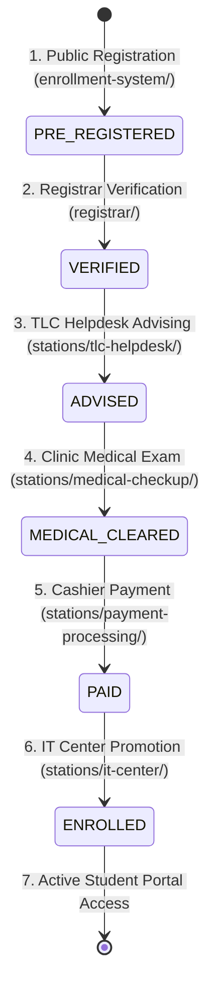
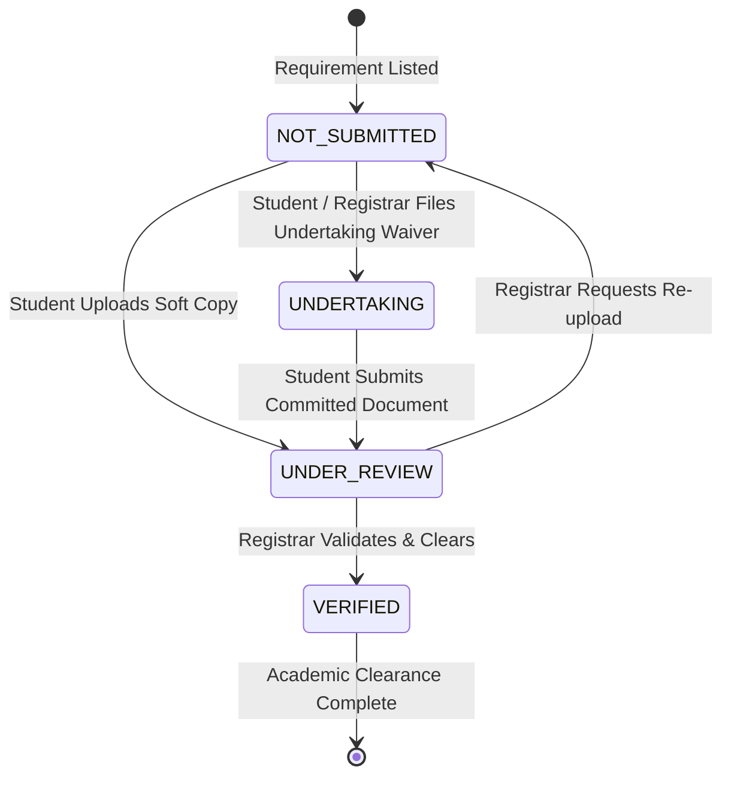

# 🎓 Student Lifecycle & Workflow State Machine

> [!info]
> Linked to the master hub: [[SYSTEM_KNOWLEDGE_BASE|Master Knowledge Base]]

## 6-Stage Pipeline

* **Sequential Invariant**: Out-of-order execution is strictly blocked by `EnrollmentService.php` (see [[Business_Rules|RULE-001]]).
* **Cashier Invariant**: Unverified or rejected applicants cannot pay (see [[Business_Rules|RULE-002]]).
* **IT Promotion**: Transactionally moves staging records to permanent directory (see [[Database_Schema|Database Schema]]).

## Admission Document Requirements & Undertaking Lifecycle

* **Student Portal Hub**: Authenticated students track and upload missing credentials under the *Documents & Undertakings Hub*.
* **Applicant Tracker**: Pending applicants monitor clearance progress in `enrollment-system/tracker.html`.
* **Automated Notifications**: Email alerts are dispatched via `EmailService::sendUndertakingReminder` when deadlines approach.

## Related Notes
* [[Station_System|Station Subsystems]]
* [[Business_Rules|System Business Rules]]
* [[Roles_and_Permissions|Roles and Authorizations]]
* [[Dangerous_Areas|Dangerous State Mutations]]
